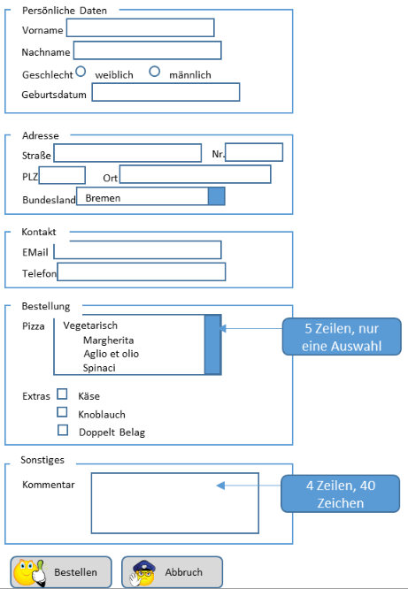

# 06a-Formulare-Teil-1
Hier finden Sie die Zusatzaufgaben für die Übung 06a

## 1 Formular Aufbau
### a) Erstellen Sie ein Formular mit folgendem Aufbau:

Verwenden Sie dabei wo möglich HTML5 Tags. Speichern Sie die notwendigen Icons in einem eigenen Unterverzeichnis ‚icon‘.
### b) Ergänzen Sie das Web-Formular um sinnvolle Einschränkungen, z.B.:
- Maximale Länge der Eingabefelder
- Muss-Felder
### c) Ergänzen Sie Web-Formular um nützliche Eingabehilfen, z.B.:
- Tastaturkürzel
- Autofokus
- Tabulator
- Reihenfolge
- Platzhaltertexte
- Autovervollständigung
### d) Machen Sie an folgenden Stellen eine Vorbelegung der Eingabefelder:
- Geschlecht: weiblich
- Ort: Düsseldorf
- Bundesland: Nordrhein
- Westfalen
- Pizza: Margherita
### e) Ersetzen Sie die Auswahlliste der Pizzen um ein Eingabefeld mit Datenliste.

## 2 Universal-Attribute und Kopfdaten
### a) Geben Sie ein Tooltip über dem Kommentar-Eingabefeld aus.
### b) Definieren Sie die Adressbasis in den Kopfdaten. Definieren Sie die URL für die Button-Icons relativ zu der Adressbasis.
### c) Ergänzen Sie die geeigneten Meta-Daten im Kopfbereich des Webformulars.
### d) Binden Sie ein Fav-Icon in die Webseite ein. Nehmen Sie dazu eines der Icons, die für die Buttons verwendet wurden.

## 3 Projekt „Eigene Website“
### a) Ergänzen Sie Ihre Website um Hyperlinks mit relativen Adressen zwischen den Seiten. Setzen Sie bei langen Seiten, die über den sichtbaren Bereich des Browsers hinausgehen einen Anker am Anfang der Seite und setzen Sie am Ende der Seite einen Link dorthin.
